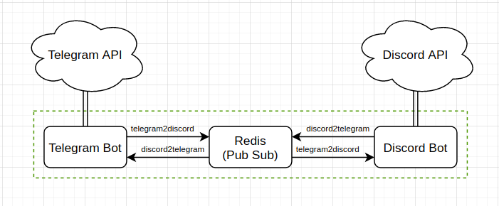
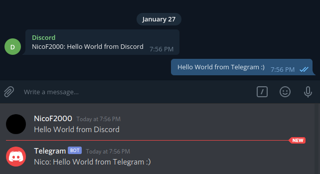

# Discord Telegram Connector

This repository contains bots for Telegram, and Discord to synchronize a discord channel with a telegram group.

## Setup Tutorial
1. Create Telegram and Discord bots (checkout this 
   [Telegram tutorial](https://core.telegram.org/bots#6-botfather), 
   [Discord tutorial](https://discordpy.readthedocs.io/en/latest/discord.html))
   
2. Adjust the bot tokens, channel id, and group id in the `docker-compose.yml`.

3. Start the services (`docker-compose up -d`)